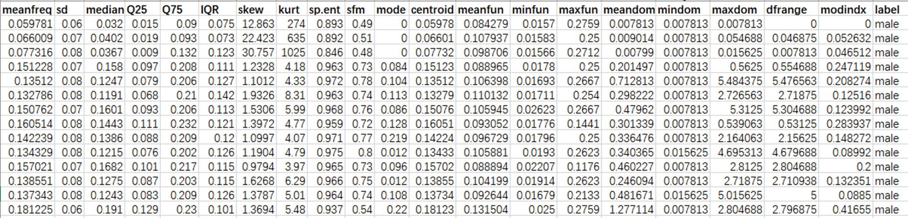

# 一、项目要求与目标

+ **利用概念学习、线性分类器、决策树、随机森林完成一次实际编程运用**

# 二、问题背景
&emsp;&emsp;通常情况下，频率比较低响度比较强的声音会被认作男性，而频率比较高响度比较弱的声音会被认作女性。但是这样的分类方法无法进行量化的分类，很难正确判断出一段声音究竟是属于男性还是女性。因此我们需要引入更多的特征，以及一个线性分类的方法来进行分类。将这些特征送入训练好的线性分类器中获取预测结果。
&emsp;&emsp;如下是一些常见的声音特征：

|   **变量**   | **含义**                                                     |
| :----------: | :----------------------------------------------------------- |
| **Meanfreq** | mean frequency (in kHz)   平均频率                           |
|    **Sd**    | standard deviation of frequency   频率的标准差               |
| **Meanfun**  | average of fundamental frequency   measured across acoustic signal   在声学信号上测量的基频平均值 |
|   **Sfm**    | spectral flatness   频谱平坦度                               |
|    **…**     | **…**                                                        |

# 三、数据预处理
## 1、数据来源
&emsp;&emsp;来自Kaggle：[Gender Recognition by Voice]("https://www.kaggle.com/primaryobjects/voicegender") 
&emsp;&emsp;链接："https://www.kaggle.com/primaryobjects/voicegender" 
&emsp;&emsp;描述：基于语音和语音的声学特性，创建该数据库以识别作为男性或女性的语音。 该数据集包括3,168个记录的声音样本，收集自男性和女性发言者。 语音样本使用seewave和tuneR软件包在R中通过声学分析进行预处理，分析频率范围为0hz-280hz。 

## 2、数据全貌概览
&emsp;&emsp;每行包含了一条声音记录，由频率等特征组成。最终标签为‘male’ or ‘female’。

 

**部分特征的直方图分布**

<table>
	<tr>
		<td></td>
		<td></td></tr>
	<tr>
		<td></td>
		<td></td></tr>
</table>

## 3、缺失项目处理
&emsp;&emsp;数据集从存在缺失项目，如下图所示，等于零的地方就是缺失项目。对于数据项目中缺失的值，这里统一采用该属性的均值进行填充。

## 4、交叉验证
&emsp;&emsp;这里采用10-folds来制作训练集。随机将训练集分为十个子集。训练10次，每次训练用1个子集评估，另9个训练。

## 5、数据可视化
&emsp;&emsp;为了方便在二维平面上对结果的可视化，这里只是从数据集中抽出两个特征作为模型的输入特征。选取的特征为IQR与meanfun。

# 四、模型建立
## 1、Logistic Regression
### 1)、逻辑回归
&emsp;&emsp;逻辑回归是一种线性分类算法，一般用于医疗、天气预报等。这种线性算法的目的是寻找一条边界线（也叫决策线），通过这条边界对数据进行分类。根据输入特征的个数（输入数据种类个数），可写成如下的线性方程：
$$
Z = \theta_{0}+\theta_{1} x_{1}+\ldots+\theta_{n} x_{n}=\sum_{i=0}^{n} \theta_{i} x_{i}=\theta^TX
$$
&emsp;&emsp;在我们的数据集中，由于只有两个特征，因此$n=2​$，可写成$Z = \theta_{0}+\theta_{1} x_{1}+\theta_{2} x_{2}​$。

### 2)、利用Sigmoid函数分类
&emsp;&emsp;我们通过逻辑回归模型求得这个$Z$只是边界线上的点，需要使用Sigmoid函数（如下）对边界线进行分类。
$$
g(z)=\frac{1}{1+e^{-z}}
$$

&emsp;&emsp;当$z=0$时，$g(z)=0.5$；$z$越小，$g(z)$越接近$0$；$z$越大，$g(z)$越接近$1$。

&emsp;&emsp;通过该特性，可以给数据提供划分分类方法。即通过g(z)和0.5对比，大于$0.5$的数据会被预测为男性，小于$0.5$的数据会被预测为女性。

&emsp;&emsp;因此我们获得预测构造函数如下：
$$
h_{\theta}(X)=g\left(\theta^{T} X\right)=\frac{1}{1+e^{-\theta^{T} X}}
$$
### 3)、模型训练
&emsp;&emsp;逻辑回归通常的训练方式有两种，一种是使用normal eqution的方式来解方程求出参数，另外一种是采用gradient decent的方式来迭代训练。这里，我们采用第二种方式。 
&emsp;&emsp;单个数据的损失值这里采用对数损失函数，如下：
$$
\operatorname{cost}\left(h_{\theta}(x), y\right)=\left\{\begin{aligned}-\log \left(h_{\theta}(x)\right) & \text { if } y=1 \\-\log \left(1-h_{\theta}(x)\right) & \text { if } y=0 \end{aligned}\right.
$$
&emsp;&emsp;一个训练epoch中，$J(\theta)$函数如下：
$$
\begin{aligned} J(\theta) &=\frac{1}{m} \sum_{i=1}^{m} \operatorname{cost}\left(h_{\theta}\left(x^{(i)}\right), y^{(i)}\right) \\ &=-\frac{1}{m}\left[\sum_{i=1}^{m} y^{(i)} \log h_{\theta}\left(x^{(i)}\right)+\left(1-y^{(i)}\right) \log \left(1-h_{\theta}\left(x^{(i)}\right)\right)\right] \end{aligned}
$$
&emsp;&emsp;最终的训练目的是使得$J(\theta)​$达到最小。由于传统的随机梯度下降法收敛速度慢，无法追踪过去的梯度值，因此我们在优化器上选择Adam优化器。

### 4)、Adam优化器

&emsp;&emsp;Adam，代表自适应矩估计，结合了动量优化和 RMSProp的思想：就像动量优化一样，它追 踪过去梯度的指数衰减平均值，就像 RMSProp 一样，它跟踪过去平方梯度的指数衰减平均值。计算流程如下：

>1. $\mathbf{m} \leftarrow \beta_{1} \mathbf{m}+\left(1-\beta_{1}\right) \nabla_{\theta} J(\theta)$
>2. $\mathbf{s} \leftarrow \beta_{2} \mathbf{s}+\left(1-\beta_{2}\right) \nabla_{\theta} J(\theta) \otimes \nabla_{\theta} J(\theta)​$
>3. $\mathbf{m} \leftarrow \frac{\mathbf{m}}{1-\beta_{1}^{T}}$
>4. $s \leftarrow \frac{s}{1-\beta_{2}^{T}}$
>5. $\theta \leftarrow \theta-\eta \mathbf{m} \oslash \sqrt{\mathbf{s}+\epsilon}​$ 
>
>注释：$\otimes $表示单元乘法，$\oslash$表示元素分割，$\epsilon$是避免被除以0的平滑项  

## 2、With Kernel Method

&emsp;&emsp;由于我们选用的数据集并不是完全的线性可分，因此我们在原来Logistic Regression模型的基础上引入一些处理非线性数据集的方法。

### 1)、多项式特征

&emsp;&emsp;在某些情况下可以将非线性变成线性可分的数据。在下图的左图中，它只有一个特征 $x_1​$的 简单的数据集，该数据集不是线性可分的。但是如果增加了第二个特征$x_2 = x_1^2​$ ，产生的 2D 数据集就能很好的线性可分。

&emsp;&emsp;因为在这个数据集中，两个特征都是处在（0，1）之内，如果多项式特征使用二次方、三次方等高次方，各个特征之间的差距不是很明显，效果并不理想。因此，这里选用的多项式特征为 $\frac{1}{2}$与$\frac{1}{3}$。 

### 2)、相似特征

&emsp;&emsp;另一种解决非线性问题的方法是使用相似函数（similarity funtion）计算每个样本与特定地标 （landmark）的相似度。例如，以前面讨论过的一维数据集为例子，并在 $x_1=-2$ 和 $x_1=1$ 之间增加两个地标。接下来，定义一个相似函数，即高斯径向基函数（Gaussian Radial Basis Function，RBF），设置 $\gamma=0.3​$。
$$
\phi_{\gamma}(x, \ell)=\exp \left(-\gamma\|x-\ell\|^{2}\right)
$$
&emsp;&emsp;它是个从 0 到 1 的钟型函数，值为 0 的离地标很远，值为 1 的在地标上。现在计算新特征。例如，看一下样本 $x_1=-1$：它距离第一个地标距离是 1，距离第二个地标是 2。 因此它的新特征为 $x_2=\exp(-0.3 * 1^2)≈0.74 $ 和 $x_3=\exp(-0.3 * 2^2)≈0.30 $。下图右边的图显示了特征转换后的数据集（删除了原始特征），它现在是线性可分了。 

&emsp;&emsp;在这个数据集中，地标的选择对模型的准确性产生了极大的影响。地标选择不够好可能会导致模型准确率反而降低；地标选择的太多会导致模型新增的特征太多，训练过程会极其缓慢。综合训练速度以及模型准确率，这里的地标选择是从训练集中每隔50个训练样本选择一个样本值来作为地标。 

# 五、实验结果及分析

&emsp;&emsp;这里引入了决策树、剪枝后的决策树、随机森林、剪枝后的随机森林等四个模型来与我们的Logistic Regression和Logistic Regression With Kernel Method这两个模型进行对比。 
&emsp;&emsp;每个模型的运行结果如下，主要包括：可视化结果、混淆矩阵、准确率以及召回率。 

&emsp;&emsp;**关于可视化结果的说明：**

&emsp;&emsp;&emsp;&emsp;橙色背景表示被模型预测为男性，紫色背景表示被模型预测为女性。 
&emsp;&emsp;&emsp;&emsp;绿色小原点表示实际标签为男性，红色小圆点表示实际标签为女性。 

## 实验结果
### 1、Logistic Regression
+ 可视化结果

 

+ 混淆矩阵
|             | predict-female | predict-male |
| ----------- | -------------- | ------------ |
| **real-female** | 287            | 28           |
| **real-male**   | 8              | 311          |
 

+ 各个类别的准确率以及召回率

 

+ 加权准确率
|                  | Result |
| :--------------: | :----: |
| **Training Set** | 0.923  |
| **Testing Set**  | 0.943  |
 

### 2、Logistic Regression With Kernel Method
+ 可视化结果

 

+ 混淆矩阵
|             | predict-female | predict-male |
| ----------- | -------------- | ------------ |
| **real-female** | 307         | 8           |
| **real-male**   | 11            | 308        |
 

+ 各个类别的准确率以及召回率

 

+ 加权准确率
|                  | Result |
| :--------------: | :----: |
| **Training Set** | 0.966  |
| **Testing Set**  | 0.970  |
 

### 3、Decision Tree
&emsp;&emsp;决策树在实现的过程中，因为连续属性的可取值数目不再有限，因此不能像处理离散属性枚举离散属性取值来对结点进行划分。因此需要连续属性离散化，这里的离散化策略是二分法。 

&emsp;&emsp;参考周志华的机器学习一书中对与连续属性的处理方式。给定训练集 D 和连续属性 a，假定 a 在 D 上出现了 n 个不同的取值，先把这些值从小到大排序，记为$\left\{a^{1}, a^{2}, \ldots, a^{n}\right\}​$。基于划分点 $t​$ 可将 $D ​$分为子集$D_{t}^{-}​$和$D_{t}^{+}​$，其中$D_{t}^{-}​$是包含那些在属性 a 上取值不大于 t 的样本，$D_{t}^{+}​$则是包含那些在属性 $a ​$上取值大于 $t ​$的样本。显然，对相邻的属性取值$a^{i}​$与$a^{i+1}​$来说，$t ​$在区间$\left[a^{i}, a^{i+1}\right)​$中取任意值所产生的划分结果相同。因此，对连续属性 $a​$，我们可以考察包含 $n-1​$ 个元素的候选划分点集合
$$
T_{a}=\left\{\frac{a^{i}+a^{i+1}}{2} | 1 \leq i \leq n-1\right\}
$$
即把区间$\left[a^{i}, a^{i+1}\right)$的中位点$\frac{a^{i}+a^{i+1}}{2}$作为候选划分点。然后，我们就可以像前面处理离散属性值那样来考虑这些划分点，选择最优的划分点进行样本集合的划分，使用的公式如下：
$$
\operatorname{Gain}(D, a)=\max _{t \in T_{a}} \operatorname{Gain}(D, a, t)=\max _{t \in T_{a}}\left(E n t(D)-\sum_{\lambda \in\{-,+\}} \frac{\left|D_{t}^{\lambda}\right|}{|D|} \operatorname{Ent}\left(D_{t}^{\lambda}\right)\right)
$$
其中$\operatorname{Gain}(D, a, t)​$是样本集合 $D ​$基于划分点 $t ​$二分后的信息增益，划分的时候，选择使$\operatorname{Gain}(D, a, t)​$最大的划分点。

+ 可视化结果

 

+ 混淆矩阵
|             | predict-female | predict-male |
| ----------- | -------------- | ------------ |
| **real-female** | 304         | 11         |
| **real-male**   | 19            | 300        |
 

+ 各个类别的准确率以及召回率

 

+ 加权准确率
|                  | Result |
| :--------------: | :----: |
| **Training Set** | 1.000  |
| **Testing Set**  | 0.953  |
 

### 4、Decision Tree With Limit
&emsp;&emsp;由于没有剪枝的决策树存在过拟合，效果不是很好，因此这里对决策树进行限制，最大深度不超过5。 
+ 可视化结果

 

+ 混淆矩阵
|             | predict-female | predict-male |
| ----------- | -------------- | ------------ |
| **real-female** | 305         | 10         |
| **real-male**   | 14            | 305        |
 

+ 各个类别的准确率以及召回率

 

+ 加权准确率
|                  | Result |
| :--------------: | :----: |
| **Training Set** | 0.978  |
| **Testing Set**  | 0.962  |
 

### 5、Random Forest
&emsp;&emsp;随机森林是决策树的一种集成，通过有放回抽样方法进行训练。随机森林算法在树生长时引入了额外的随机。与在节点分裂时需要找到最好分裂特征相反 （决策树中的方法），它在一个随机的特征集中找最好的特征。它导致了树的差异性。 
&emsp;&emsp;最后将所有决策树输出的结果以及概率按照模型的准确率进行加权平均得到随机森林预测的结果。 

+ 可视化结果

 

+ 混淆矩阵
|             | predict-female | predict-male |
| ----------- | -------------- | ------------ |
| **real-female** | 309         | 6          |
| **real-male**   | 13            | 306        |
 

+ 各个类别的准确率以及召回率

 

+ 加权准确率
|                  | Result |
| :--------------: | :----: |
| **Training Set** | 1.000  |
| **Testing Set**  | 0.970  |
 

### 6、Random Forest With Limit
&emsp;&emsp;由于没有剪枝的随机森林也存在过拟合的现象，效果不是很好，因此这里对随机森林同样也进行限制，最大结点数不超过16。 
+ 可视化结果

 

+ 混淆矩阵
|             | predict-female | predict-male |
| ----------- | -------------- | ------------ |
| **real-female** | 308         | 7          |
| **real-male**   | 11            | 308        |
 

+ 各个类别的准确率以及召回率

 

+ 加权准确率
|                  | Result |
| :--------------: | :----: |
| **Training Set** | 0.978  |
| **Testing Set**  | 0.972  |
 

## 分析
### ROC曲线
&emsp;&emsp;受试者工作特征曲线 （receiver operating characteristic curve，简称ROC曲线），又称为感受性曲线（sensitivity curve）。得此名的原因在于曲线上各点反映着相同的感受性，它们都是对同一信号刺激的反应，只不过是在两种不同的判定标准下所得的结果而已。受试者工作特征曲线就是以假阳性概率（False positive rate）为横轴，真阳性（True positive rate）为纵轴所组成的坐标图，和受试者在特定刺激条件下由于采用不同的判断标准得出的不同结果画出的曲线。 
&emsp;&emsp;ROC曲线是根据一系列不同的二分类方式（分界值或决定阈），以真阳性率（灵敏度）为纵坐标，假阳性率（1-特异度）为横坐标绘制的曲线。在本实验中的ROC曲线如下： 

&emsp;&emsp;由于这几个模型比较接近，因此ROC曲线的放大图如下：

### AUC
&emsp;&emsp;AUC（Area Under Curve）被定义为ROC曲线下与坐标轴围成的面积，显然这个面积的数值不会大于1。又由于ROC曲线一般都处于y=x这条直线的上方，所以AUC的取值范围在0.5和1之间。使用AUC值作为评价标准是因为很多时候ROC曲线并不能清晰的说明哪个分类器的效果更好，而作为一个数值，对应AUC更大的分类器效果更好。 

|                                            | **AUC** |
| :----------------------------------------: | :-----: |
|          **Logistic Regression**           | 0.9811  |
| **Logistic Regression With Kernel Method** | 0.9917  |
|             **Decision Tree**              | 0.9528  |
|        **Decision Tree With Limit**        | 0.9789  |
|             **Random forest**              | 0.9887  |
|        **Random forest With Limit**        | 0.9930  |

### 结论
&emsp;&emsp;从AUC表格中可以看出，使用了核方法之后的Logistic Regression模型效果被大幅度提高，性能接近剪枝后的随机森林。